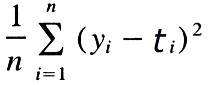
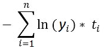
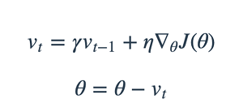
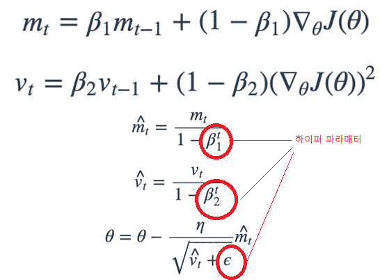

# 머신러닝 개념

- [머신러닝 관련 SOTA 코드](https://paperswithcode.com/)
- SOTA : 최-신 코드

## 비지도 학습
    Generative vs Adversarial
- GAN (생성적 적대신경망) : [위키링크](https://ko.wikipedia.org/wiki/%EC%83%9D%EC%84%B1%EC%A0%81_%EC%A0%81%EB%8C%80_%EC%8B%A0%EA%B2%BD%EB%A7%9D)
    + 생성모델 (Generative Model) : 음성, 사진등
    + 경쟁모델 (Adversarial Model) : 
    [음성합성 링크: Carpedm20](https://carpedm20.github.io/tacotron/)

## 강화학습
    
- 가장 유명한 구글의 구현 (DEEP-Q Learning) [아타리 블록게임](https://www.youtube.com/watch?v=V1eYniJ0Rnk)

## 딥러닝
- 머신러닝의 분야중 하나. 가장 주목 받고 있음.
- 최근에는 기존 머신러닝으로 하던 것들 대부분을 딥러닝으로 대체되어가는 상황 (2019년)

---
## 퍼셉트론
- WX+ b 로, 신경을 토대로 만들어진 이론
- 선형회귀등의 예측모델의 기본단위.

---

## 주로 사용되는 라이브러리
    numpy - 수치연산
    tensorflow - DL (텐서 단위의 API = 저레벨 API)
    keras - DL 의 고레벨 API

---

## 활성화 함수들
    Hidden / Ooutput 별로 구분됨.

### Linear
- 출력그대로 전달.

### RELU
- 0 이하는 0, 1이상은 Linear
- __Gradient Vanishin__ 을 상당히 해결

### Gradient Vanishing : DNN 에서 나타난 문제점.
- 다중 계층에서 발생하는 문제. (AI 2차 겨울의 원인) 
- 입력층과 출력층의 연관성이 사라지는 현상.
- 연속적인 미분등으로 인해서, 입력단으로 갈수록 Weight 가 낮아짐.

### tanh (하이퍼볼릭 탄젠트)
- __HIDDEN LAYER__ 에서 사용.
- feature 값의 범위를 줄여주는 역할. 
- -1 ~ 1 로 출력

### Sigmoid / Softmax 의 차이
- __OUTPUT LAYER__ 에서 사용.
- sigmoid : 2개 사이의 확률을 0~1 사이로 나타냄 (합은 1)
- softmax : 3개 이상간의 확률을 0~1 사이로 나타냄. (합은 1)
- 2개면 sigmoid, 3개 이상의 분류는 softmax
- 공통점 : 합이 1
- 차이점 : 대상의 갯수. 2 vs N 

---

## Lost, Cost 함수
    답을 얼마나 잘 맞추었는가? 를 확인하는 수치.

- MSE : Mean Square Error
    + 최소제곱

- CEE : Cross Entropy Error
    + 정답을 예측한 확률을 기준으로 오류량 확인.
    + 데이터의 유형에 따라 categorical, binary 등 여러가지 방법 구별.

---

## Optimizer 최적화
    Weight 를 얼마나 수정 할 것인가? 를 정하는 방법.
    loss 값 * η 을 정하는 계산방법들.
    하이퍼 파라매터를 사람이 직접 설정하여, 최적화 방식 조정가능.
    lr : 러닝레이트. η

### Batch GD : Gradient Descent
- 전체 데이터를 기준으로 LOSS 를 구함.
- __처리 시간__이 길다.
- 답에 가까워질수록 (loss 가 0에 수렴할수록) 느려진다.

### SGD : Stochastic Gradient Descent
- 부분적인 랜덤 데이터를 기준 (10~20%) 으로 LOSS 를 구함.
- 매 에폭때 마다 loss 에 사용되는 데이터가 달라짐.
- BGD 보다는 좀 더 빠르며, Local Minima 에서 나올 확률을 높임.
- GD, SGD 모두 __LR__ 에 크게 좌우 받음.
- 그래도 GD 의 근본적인 단점은 사라지지 않았다. (loss 0에 수렴할수록 느려짐)

#### Local Minima : 옵티마이저에서 발생할수 있는 문제
- GD 과정중에서, 큰 골짜기가 아니라, 작은 골짜기에서 최적화가 끝나는 상황.
[극값위키](https://ko.wikipedia.org/wiki/%EA%B7%B9%EA%B0%92)

### Momentum : 관성
- __이전의 손실기울기값__을 참조하여, 현재의 Loss 화 함께 계산함
- 모멘텀 계수 (감마 γ: 1보다 작은 수) 를 이용해, 이전에 이동하던 속도값의 반영치를 조정.
- Local Minima 문제를 해결.

 
- 하이퍼 파라매터 : lr, 모멘텀계수(γ = 0.9 정도) 

### NAG
    Nesterov Momentum
- 기존 momentum 의 계산을 단축.

### Adagrad : Adaptive Gradient - 적응형 기울기
- 이전에 변동된 __Gradient 의 합__을 사용하여, __Learning Rate 를 변화__ 에 반영
- 기울기 합을 LR 의 분모에 넣고 계산. (식 참조)
- 기울기가 클수록 LR 이 작아지고, 기울기가 작을수록 LR 이 커지는 방식.
- 변화가 적은 Gradient 일때는 적극적으로 값이 변화함.
- 하이퍼 파라매터 : lr, ε

 
- Gt = 이전에 변동된 gradient 의 합.
- ε = 0 아닌 매우 작은값.

### Adam : Ada]grad + Momentum
- 두가지의 특성을 합친것
- 모멘텀의 일정비율만큼 + Adagrad 의 부분.
- __R-Adam__ 이라는 새로운 알고리즘이 가장 최신의 알고리즘.

 
- β1, β2 를 정함.

### R-ADAM
[논문](https://arxiv.org/abs/1908.03265)
[R ADAM 깃허브](https://github.com/LiyuanLucasLiu/RAdam)

---

## 딥러닝 실습

### CNN 에서 피처 뽑기
    Channel, Filter, Feature map, Padding

- Channel : 컬러 등
- Filter : 합성곱을 구할 영역의 크기 및 값들.
    + 각 값들마다 곱하고, 합침.
- Feature Map

- **Inception v3** (구글넷 머신러닝) 의 구현방식.

### RNN
    
- __Recursive__ Neural Network
- 연속적인 입력의 형태 (글의 문장) 을 학습시키는 방법
- __시계열 데이터__등 연속적 데이터 분석에 적합

>H = F(H', x)
- H : 새로운 상태
- F : 파라매터가 포함된 함수
- H' : 이전의 상태
- x : 이번에 입력될 벡터

이러한 방식으로, 재귀식으로 직렬데이터를 학습.

#### RNN 응용 분야
1. 주식시장 또는 집값변화등
2. 대화봇 (자동 응답 또는 일상적인 답변 부분)
3. 문서 분류 (특허관련)
4. 번역

#### Rnn 네트워크 방식
- 1 to 1
- n to 1
- n to n

#### RNN 모델의 다양한 유형과 특징
- LSTM : H' 에 반영되는 이전 데이터를 여러개 쓰는것.
- GRU : LSTM 의 간소화 버젼 (한국에서 만듬.)

## 딥러닝의 성능을 늘리는법? (CNN)

- 층을 늘리자!! 더.많.이
    + 파라매터가 너무 늘어나서 __OVER FITTING__

- Sparsely Connected
    + 현 레이어에서 유사한 것들은 skip 하여, 다음 계층의 계산에서 생략.
    + 그래    도 성능이 좋지 않았다.

- 레이어 튜닝 (Googlenet)
    + 1x1 레이어를 통해 깊이를 만듬.
    + 데이터를 다양한 크기의 필터를 사용하여 피처를 확인하는 방법.
    + 그리고 3x3 필터 2개가 5x5 필터를 사용하는것보다 연산량이 적어서, v3 버젼부터는 3x3 필터를 2개 사용하는 것으로 바뀜

## Batch Normalization
    모델을 정규화 하는 최적화 기법.

- 데이터 분포를 늘리는 것 ?
- 공변환 (?)
- 레이어 단위의 출력들을 정규화 하는 것?
    + Conv2D (합성곱계층) 에서 각 출력값들을 정규화.
    + BatchNormalization

---

## R-CNN ?
- 딥러닝을 이용한 머신러닝기능을 혼합한 기능 (Classification 및 Detection)
- 입력데이터의 Image 에 사람이 직접 boxing - labeling 
- ensanble 을 이용한 기능보다 향상된 기법

- __R-CNN 의 과정__
    1. Selective Search 로 Object 후보군(Proposal) 검출(2000개)
    2. 후보군이 있는것으로 보이면, proposal 에 박싱
    3. proposal 을 CNN 에 통과시켜 Feature map 벡터 추출
    4. 해당 피처맵으로 분류기에서 분류
    5. 박싱에 라벨 분류한 결과를 부착, 

- 한계
    1. 너무 오래걸림
    2. 리사이즈의 왜곡 손실
    3. 3가지의 모델 학습 필요

## Fast R-CNN 기법 : 빨라진 R-CNN 기법
- End-To-End 모델 : ?

# 비지도 학습
    라벨 없는 학습.

- AutoEncoder
- GAN

## Auto Encoder
    차원축소방법을 이용한 압축방법.

- 이미지 => 압축정보 (인코더) =>  복원정보 (디코더) 을 하는 모델.
- 인코딩 함수 : 디코딩 함수 들이 필요함.
- 손실함수의 계산원리 : 원본에 대한 압축 - 복원 정보간의 거리

## Conv - Auto Encoder
    합성곱 방식을 사용한 방법
- 압축/복원 방법을 이미지의 합성곱연산 형식으로 함.
- 압축에는 MaxPool, 복원시에는 Upsampling

## Denoising Conv - Auto Encoder
    합성곱 방식에서 노이즈제거 까지
- 의도적으로 노이즈를 준 데이터를 트레이닝의 입력, 노이즈가 없는 데이터를 정답
- 노이즈가 제거된 출력이 나옴.

### Autoencoder : mnist 실습.
    x_train, x_test 만으로 압축/복원이 얼마나 잘 되는가를 봄.

## GAN
    G :Generative Model (생성자)
    A : Adversarial Model (검사자 = Discriminator Model)
    두개의 모델을 학습시켜 생성자가 만든 내용을 검사자가 검사하는 형식

- 학습 과정
    1. G 는 진짜 데이터를 가지고 학습.
    2. A 는 노이즈가 존재하는 데이터를 가지고 (영감만 가지고 생성한다는 의미) 학습

- 추론 과정
    1. G 는 데이터를 가지고 학습하여, 가짜데이터를 생성
    2. A 는 가짜데이터를 보고, 진짜인지 아닌지를 검사.

- 문제점
    + 학습된 트레이닝셋에 너무 매몰되는 상황이 발생함.
        * 학습된 데이터만을 일관적으로 생성하려는 것.

## Cycle GAN
    기존 GAN 이 가진 문제점을 해결 (정답매몰상태)
    생성자2개를 사용하는 방법

- 하나는 GAN 의 생성자 처럼 사용
- 나머지 하나는 생성자로 만든 이미지를 되돌리는 역할.
- 두개의 생성자 모델을 비교하여, 이미지의 맥락을 이해하게 만드는 것.
- Generator : Unet 구조를 이용해, 구현

## Star GAN
    Cycle GAN 을 여러 방향으로 이어둔 형태

## Word2Vec
    자연어 처리하는 DL
    하나의 문장을 벡터화 한다는 개념

- Frequency based Embedding
    + BOW - Bag of words
        * 모든 단어를 인덱스
    + Counter Vector
        * 단어 출현의 빈도를 세는 방법
    + __TF-IDF__ : Term Frequenct - Inverse Document Frequency
        * 빈도 + 중요도를 파악하는 방법
        * TF(단어 빈도) 와 IDF(전체문서상 단어빈도) 의 곱으로 TF-IDF 의 값을 구함.
        * TF = 단어횟수 / 문장의 총 단어
        * IDF = 문서상의 총 단어 횟수 / 총 문장(또는 문서) 개수

- Word2vec : CBOW & Skip-gram
    1. CBOW
        + 하나의 단어를 빼서, 문장과 연관성을 추정하는 방법
    2. Skip-gram
        + 타겟 단어에서 원본단어를 추정하는 방법.

- bert : 현존하는 최상 언어처리 모델 (번역등)
    + attention is all you need <= 기반 논문
        * attention : 주목할 단어를 지정하는 기법
        * 문장을 단어별로 나누었을떄, 특정 단어가 없을때도 추측이 잘되는가
        * 모듈을 transformer 이라 부름.
    + 12개의 transformer => bert!